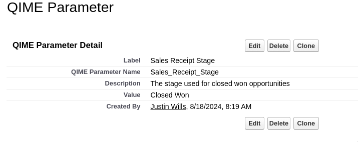
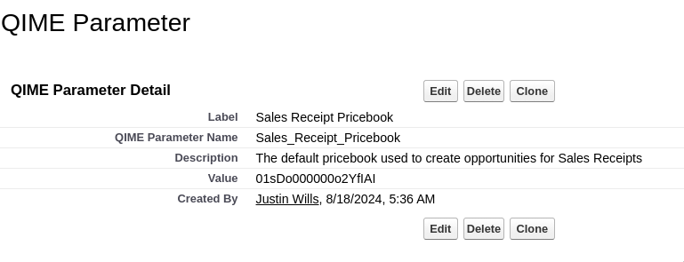
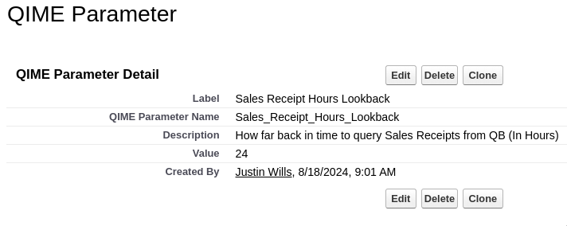

## Syncing Sales Receipts

Sales Receipts are another Quickbooks object that represent a customer payment. They signify a payment that has already been collected. We use the `opportunity` object in Salesforce to signify Sales Receipts.

## Required Configuration

Because Sales Receipts are created as opportunities, we need to configure the following:

- Stage Name
- Pricebook

This configuration data is stored in the Custom Metadata `QIME Parameter`

### Sales Receipt Stage Name

We can set the stage name opportunities are created with under the `Sales Receipt Stage` metadata type. The default stage is `Closed Won`.



### Sales Receipt Pricebook

We can set the pricebook opportunities are created with under the `Sales Receipt Pricebook` metadata type. This **must** be configured.



### Sales Receipt Lookback

We can set the amount of hours that sales receipts are queried with under the `Sales Receipt Hours Lookback` metadata type. The deafult is **24** hours.



## Sales Receipt Mapping

### Opportunity Mapping

| QuickBooks Field | Salesforce Label | Salesforce API Name   |
| ---------------- | ---------------- | --------------------- |
| Transaction Date | Close Date       | `CloseDate`           |
| Customer Id      | Customer Id      | `customer_id__c`      |
| Id               | QBO ID           | `qbo_Id__c`           |
| Document Number  | Document Number  | `Docuement_Number__c` |
| Name             | `SR-DocNumber`   | `qbo_SyncToken__c`    |
| Delivery Time    | Delivery Time    | `Delivery_Time__c`    |
| All Emails       | All Emails       | `all_emails__c`       |
| All CC Emails    | All CC Emails    | `all_cc_emails__c`    |
| All BCC Emails   | All BCC Emails   | `all_bcc_emails__c`   |
| Payment Method   | Payment Method   | `payment_Method__c`   |
| Payment Status   | Payment Status   | `Payment_Status__c`   |
| Balance          | Balance          | `Balance__c`          |
| Tax              | Tax              | `tax__c`              |
| Class            | Class            | `class__c`            |

### Opportunity Product Mapping

| QuickBooks Field | Salesforce Label | Salesforce API Name   |
| ---------------- | ---------------- | --------------------- |
| Id               | QBO ID           | `qbo_Id__c`           |
| Document Number  | Document Number  | `Docuement_Number__c` |
| Line Number      | LineNum          | `LineNum__c`          |
| Amount           | Sales Price      | `UnitPrice`           |
| Description      | Description      | `Description`         |
| ItemRef Id       | ItemRef Id       | `ItemRef_Id__c`       |
| Qty              | Quantity         | `Quantity`            |
| Class            | Class            | `Class__c`            |

### Syncing Classes

Classes are a way of further categorizing transactions. They can be configured at the top level of the transactrion or the product level. Learn more about classes [here](https://quickbooks.intuit.com/learn-support/en-us/help-article/class-list/create-manage-classes-quickbooks-online/L1QzEOUxM_US_en_US)

## Syncing All Sales Receipts

During an initial setup, it is advised to sync all sales receipts from QuickBooks to Salesforce. To bring all sales receipts from QuickBooks to Salesforce, perform the following:

1. Open the `Developer Console`
2. Run the following code snippet

```apex
System.enqueueJob(new qime.QBSalesReceiptQueueable(0, 0, 50, 0));
```

## Scheduling Sales Receipts Sync

Sales Receipts can be brought over hourly. To schedule Sales Receipts syncing, use the `scheduled jobs` tab in the `QIME` app. To manually schedule, perform the following:

1. Open the `Developer Console`
2. Run the following code snippet

```apex
System.schedule('QB Sales Receipt Sync XX:00', '0 0 * * * ?', new qime.QBSalesReceiptBatch());
```
